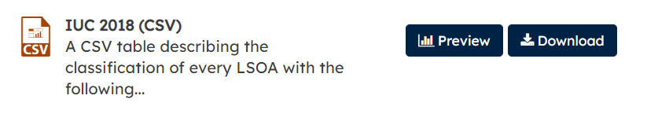

```{r setup, include=FALSE}
knitr::opts_chunk$set(echo = TRUE)
#set working directory to /data-user
knitr::opts_knit$set(root.dir = 'C:/Users/nick/Dropbox/Work/2020-010-CDRC-training/iuc-k-means-clustering/cdrc-iuc-k-means-clustering-course-material-repo/data-user')
```

# Welcome

This is part 1 of the 2 part course from CDRC on the Internet User Classification (IUC) and K-Means Clustering. The video in this part introduces the IUC data set, and the practical session shows you how to work with the IUC dataset in R. *If you are completely new to RStudio, please check out our [Short Course on Using R as a GIS](https://data.cdrc.ac.uk/dataset/short-course-using-r-gis)*. 

After completing this material, you will:  

- Know what IUC is and what it can be used for  
- Be aware of how IUC was created  
- Understand some of its key strengths and weaknesses  
- Know how to use Internet User Classification (IUC) in RStudio  

----

<iframe width="560" height="315" src="https://www.youtube.com/embed/zmpVn95Gvkc" frameborder="0" allow="accelerometer; autoplay; clipboard-write; encrypted-media; gyroscope; picture-in-picture" allowfullscreen></iframe>

----


# Part 1: Internet User Classification (IUC)

### Downloading IUC Data

Our first step is to download the IUC dataset:

- Open a web browser and go to https://data.cdrc.ac.uk  

- Register if you need to, or if you are already registered, make sure you are logged in.  

- Search for IUC  

- Open the Internet User Classification page.  

{ width=80% }

- Scroll down and choose the download option for the IUC 2018 (CSV)  

{ width=80% }

- Save the `iuc2018.csv` file to your working directory.  

*You can download the shapefile with the data already joined to the LSOA boundaries, but this is the national data set and is quite large (75MB). R will work with this, but might be a bit slow. The steps below will only get the shapefile for Liverpool, which will be a much smaller file.*

- Open the file in Excel - what data do we have?  

- *Check out the User Guide if you want to.*  

### Loading IUC data in R

- Start a new Script in RStudio.  

- Set your working directory.  

- Use this code to read in the file:

```{r, comment=NA}
iuc <- read.csv("iuc2018.csv")
```

- Use `head()` to check what the data are:

```{r, comment=NA}
head(iuc)
```

- Is this the data we expect to see?  

- Use `View()` to look at the data.  

- Use `str()` to see whether they are character or numeric variables.  

```{r, comment=NA}
str(iuc)
```

- Is this what you expect?  

*There will be character `chr`, integer `int` and numeric `num` values in this data frame. Make sure you can identify which is which, and that you know what the differences are.*

- How are the data distributed? (try `hist()`).  

### Loading Spatial Data

To create any maps, we need some spatial data. 

- Go to http://census.edina.ac.uk/ and select **Boundary Data Selector**. 
- Then set **Country** to **England**, **Geography** to **Statistical Building Block**, **dates** to **2011 and later**, and click **Find**.
- Select **English Lower Layer Super Output Areas, 2011** and click **List Areas**. 
- Select **Liverpool** from the list and click **Extract Boundary Data**. 
- After a 5 to 20 second wait, click `BoundaryData.zip` to download the files. 

Extract the files, and move all the files starting with the name `england_lsoa_2011` to your working folder. 
  
```{r, echo=FALSE, comment=NA}
unzip("england_lsoa_2011.zip")
```

We will also need some spatial libraries:

```{r,message=FALSE,display=FALSE, warning = FALSE}
#load libraries
library(sf)
library(tmap)
```

Read in the spatial data we downloaded from Edina:

```{r, comment=NA, results='hide'}
#read in shapefile
LSOA <- st_read("england_lsoa_2011.shp")
```

- Has the data been read in correctly? Try `head()`, `class()` and `str()`. 
 
Let's do a quick map:

```{r, comment=NA}
qtm(LSOA)
```

- Is the data correct?  

### Joining Attribute and Spatial Data

Next step is to join the attribute data (`iuc`) to the spatial data (`LSOA`). 

Use `head()` to check which columns we are using for the join:

```{r, comment=NA, eval=FALSE}
#check which columns we are joining
head(iuc)
head(LSOA)
```

```{r, comment=NA}
#join attribute data to LSOA
LSOA <- merge(LSOA, iuc, by.x="code", by.y="LSOA11_CD")

#check output
head(LSOA)
```

Finally, we can plot the maps quickly using `qtm()` from the `tmap` library:

```{r, comment=NA}
#ahah index
qtm(LSOA, "GRP_CD")
```

This works well. However we don't get many options with this. We can use a different function `tm_shape()`, which will give us more options. 

```{r echo=TRUE, eval=FALSE}
tm_shape(LSOA) +
tm_polygons("GRP_CD")
```

```{r echo=TRUE, eval=FALSE}
tm_shape(LSOA) +
  tm_polygons("GRP_CD", palette = "Set3", n = 10) +
tm_layout(legend.title.size = 0.8)
```

This allows us to change the title, colours and legend title size. We are now using a qualitative palette as these data have no inherent order (i.e. group 1 is not more or less than group 2). 

### Customising Colours

We can customise the colours. Try running this code to see the different palette options:

```{r}
library(RColorBrewer)
display.brewer.all()
```

*This webpage also has some more information https://www.r-graph-gallery.com/38-rcolorbrewers-palettes.html*

We can also specify the colours ourselves, for example using the colours from the CDRC Maps website:

```{r}
my_colours <- c("#ea4d78","#f36d5a","#e4a5d0","#ffd39b","#a5cfbc","#d2d1ab","#79cdcd","#dd7cdc","#808fee","#8470ff")
tm_shape(LSOA) +
  tm_polygons("GRP_CD", palette = my_colours, n = 10) +
tm_layout(legend.title.size = 0.8)
```

Note the order of the colours is important. Colour for group 1 is first, group 2 second and so on. I got the colours from the Maps site, using https://imagecolorpicker.com/ to identify the codes for each colour.

{}

If you use the cluster name (rather than group number) it will assign the colours alphabetically - so make sure you check on your map which colour is assigned to which group!

*To map this correctly, you need to re-order the colours so they match the correct cluster group in alphabetical order. See [part1-example-script.R](X) for an example of this.*

### Exercise

By now you should have a R script with all the steps to:

- read in the IUC data  
- read in the spatial data (for whatever area you want to show)  
- join the two data sets  
- plot a map  

Try creating a map for a different area of the UK, using the script you have. 

<!-- What problems do you come across? -->
  
<!-- limitations of IUC -->
<!-- limitations of R -->

# Additonal Exercises

### Loops

Loops are a great computer programming concept we can use. Working from the example above, and the loop code from the [Short Course on Using R as a GIS](https://data.cdrc.ac.uk/dataset/short-course-using-r-gis), can you write a loop to create a map for each domain of the AHAH index?

**Mini R Course loop code:**

```{r message=FALSE, warning=FALSE, comment=NA, eval=FALSE}
#set which variables will be mapped
  mapvariables <- c("AllUsualResidents", "Age00to04", "Age05to07")

#loop through for each map
  for (i in 1:length(mapvariables)) {
  #setup map
    m <- tm_shape(LSOA) +
      #set variable, colours and classes
      tm_polygons(mapvariables[i], palette = "Greens", style = "equal") +
      #set scale bar
      tm_scale_bar(width = 0.22, position = c(0.05, 0.18)) +
      #set compass
      tm_compass(position = c(0.3, 0.07)) + 
      #set layout
      tm_layout(frame = F, title = "Liverpool", title.size = 2, 
                title.position = c(0.7, "top"))
    #save map
    tmap_save(m, filename = paste0("map-",mapvariables[i],".png"))
  #end loop
  }
```

### Counting Population within each Cluster

Now we have these cluster classifications, how can we link them to people? 

- Try joining on population data from the [Short Course on Using R as a GIS](https://data.cdrc.ac.uk/dataset/short-course-using-r-gis) on to our LSOA variable which already has the Internet User Classification (IUC) data in it. 

- You can then get the total population by cluster:

```{r message=FALSE, warning=FALSE, comment=NA, eval=FALSE}
aggregate(LSOA$AllUsualResidents, by=list(LSOA$GRP_CD), FUN=sum)
```

----

This practical was written using R 4.0.2 (2020-06-22) and RStudio 1.3.1093 by Dr. Nick Bearman (nick@geospatialtrainingsolutions.co.uk). 

This work is licensed under the Attribution-NonCommercial-ShareAlike 4.0 International License. To view a copy of this license, visit http://creativecommons.org/licenses/by-nc-sa/4.0/. The latest version of the workbook is available from https://data.cdrc.ac.uk/dataset/advanced-gis-methods-training-iuc-and-k-means-clustering and https://github.com/nickbearman/cdrc-iuc-k-means-clustering-course. This version was created on `r format(Sys.time(), '%d %B %Y')`. 

