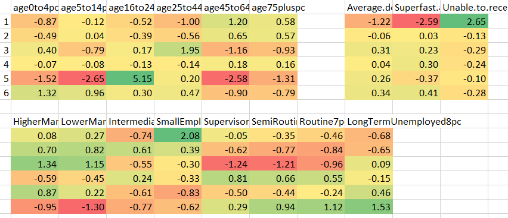
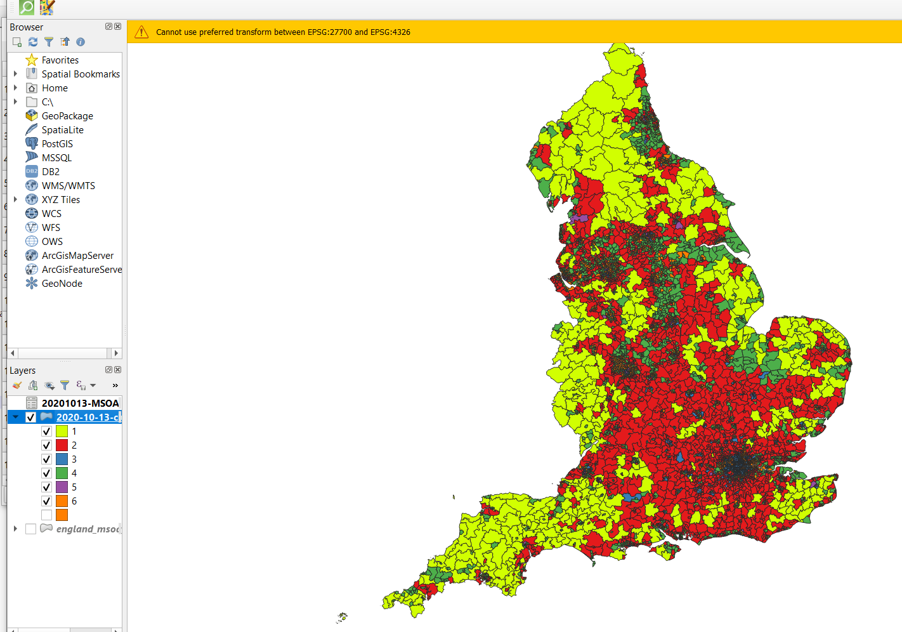

  
```{r setup, include=FALSE}
knitr::opts_chunk$set(echo = TRUE)
#set working directory to /data-user
knitr::opts_knit$set(root.dir = 'C:/Users/nick/Dropbox/Work/2020-010-CDRC-training/iuc-k-means-clustering/cdrc-iuc-k-means-clustering-course-material-repo/data-user')
```

# Welcome

This is part 2 of the 2 part course from CDRC on the Internet User Classification (IUC) and K-Means Clustering. The video in this part introduces K-Means clustering, and the practical session shows you how create your own K-Means cluster in R.  

After completing this material, you will:  

- Know what K-means clustering is and what it can be used for  
- Be aware of how K-means clustering was used to create the IUC
- Understand some of its key strengths and weaknesses  
- Know how to create your own custom clustering in RStudio  

----

<iframe width="560" height="315" src="https://www.youtube.com/embed/YNvnavVgoNE" frameborder="0" allow="accelerometer; autoplay; clipboard-write; encrypted-media; gyroscope; picture-in-picture" allowfullscreen></iframe>

----

# Part 2: K-Means Clustering

We are going to replicate the geodemographic classification for internet access and use. 

### Downloading Classification Source Data
  
To create an index, we are going to use some source files I have put together. These are for each MSOA, and consist of:

<!-- 
Table 
Variable | Definition
---|---
-->

| Variable  | Definition |
|---|---|
|`GEO_CODE` | MSOA Code |
| `age_total`, `age0to4pc`, `age5to14pc`, `age16to24pc`, `age25to44pc`, `age45to64pc`, `age75pluspc`| percentage of people in various age groups |
| `NSSEC.Total`, `HigherManagerial1pc`, ``LowerManagerial2pc`, `Intermediate3pm`, `SmallEmployers4pc`, `SupervisoryTechnical5pc`, `SemiRoutine6pc`, `Routine7pc`, `LongTermUnemployed8pc`| percentage of people in different NS-SEC groups|
| `Average.download.speed..Mbps.`, `Superfast.availability`, `Unable.to.receive.decent.broadband`, `Receiving.under.2.Mbps`, `Receiving.under.10.Mbps`, `Receiving.over.30.Mbps`| measures of broadband use and availability |


These data have all been processed to be at MSOA level. 

- Download the file `internet-input-data.csv` from the website.  

- Have a look at the file in Excel.  

### Loading Source data in R

- Start a new Script in RStudio.  

- Set your working directory.  

- Use this code to read in the file:
  
```{r, comment=NA}
data <- read.csv("internet-input-data.csv")
```

- Use `head()` to check what the data are:
  
```{r, comment=NA}
head(data)
```

- Is this the data we expect to see?  
  
- Use `View()` to look at the data.  

- Is this what you expect?  
  
*There will be character `chr`, integer `int` and numeric `num` values in this data frame. Make sure you can identify which is which, and that you know what the differences are.*
  
- How are the data distributed? (try `hist()`).  
  
### Setup

We need some libraries for this work. Remember to install them if you haven't got them installed already. 

```{r message=FALSE, comment=NA}
#load libraries (and install if needed)
  library(reshape)
  library(ggplot2)
```

### Extract data for Clustering

The K-means cluster function will cluster *all* of the data in the table, so we need to remove everything we don't want clusters. Use `colnames(data)` to get the column index numbers, and then extract the columns we want to use in the K-Means Clustering Process

```{r message=FALSE, comment=NA}
#separate out data to be clustered
  colnames(data)
  cluster.data <- data[, c(3:8,10:17,18:20)]
  head(cluster.data)
```

We also need to rescale the data so everything is on a similar scale, as the speed data (Mbps) is very different to the other data. 

```{r message=FALSE, comment=NA}
 cluster.data <- scale(cluster.data) 
```

### Elbow Plot

Our first step in the analysis is to create an elbow plot, to see how many clusters we want to specify for the K-Means analysis. 

We run the K-Means analysis for 1, 2, 3 and so on up to 15 clusters, and the calculate and plot the Within Sum of Squares (`wss`) for each one. 

```{r message=FALSE, comment=NA}
#Determine number of clusters required by elbow plot
  wss <- (nrow(cluster.data)-1)*sum(apply(cluster.data,2,var))
  for (i in 2:15) wss[i] <- sum(kmeans(cluster.data,
                                       centers=i)$withinss)
  plot(1:15, wss, type="b", xlab="Number of Clusters",
       ylab="Within groups sum of squares", main = "K-means: distance from mean by cluster amount", cex.axis = 0.90, lwd = 2)
  abline(v=c(1:15), lty=1.5, lwd=0.5, col=336) 
```

Based on the elbow plot, we need to choose the number of clusters. Based on this example above, we are going to use 7 clusters. 

*The interpretation of an elbow plot can be quite subjective, and in this example, 8 clusters could be easily justified. You would need to try with 8 as well as 7, and see what output you get.*

### K-Means Cluster Analysis

We are going to run our cluster analysis 10 times, because there is an element of randomness within the clustering, and we want to make sure we get the best clustering output. This will run the clustering code 10 times. 

```{r message=FALSE, comment=NA}
#K-Means (7 clusters with 10 iterations)
  clusters <- list()
  fit <- NA
  for (i in 1:10){
    print(paste("starting run", i, sep=" "))
    class.7 <- kmeans(x=cluster.data, centers=7, iter.max=1000000, nstart=1)
    fit[i] <- class.7$tot.withinss
    if (fit[i] < min(fit[1:(i-1)])){
      clusters <- class.7}
  }
```

We then have a bit of post processing to extract some useful summary data for each cluster:

```{r message=FALSE, comment=NA}
#process and show cluster size
  kfit5 <- clusters
  kfit5$size

#extract m values
  k5_mvalues<- aggregate(cluster.data,by=list(kfit5$cluster),FUN=mean)
#process cluster data to extract
  k5_mvalues_N <- as.data.frame(k5_mvalues[,])
  View(k5_mvalues_N)
  write.csv(k5_mvalues_N, "cluster-means.csv")
```

This (`k5_mvalues_N`) is the mean values for each of the variables for each cluster. We have also saved this as a CSV file which we can open in Excel. 
I have opened this in Excel, split up the data into the three groups (age, internet and NS-SEC) and then applied Conditional Formatting to each group, to pick out the highest and lowest values. *Remember, your values may be different*

{  }

Here we can see that only cluster 1 shows a clear pattern with Internet usage / infrastructure, and clusters 3 and 5 are driven primarily by age and clusters 1, 3 and 6 are driven by NS-SEC. 

We could develop our analysis by looking at this summary, and removing certain variables, and re-running the cluster analysis. 

We can also plot the mean variation within clusters within R:

```{r message=FALSE, comment=NA}
  library(ggplot2)
  #melt data for graph
  k5df <- melt(k5_mvalues_N ,  id = "Group.1", variable_name = "Variables")
  View(k5df)
  #graph data  
  ggmeans <- ggplot(k5df, aes(Group.1,value)) + geom_line(aes(colour = Variables)) + 
  scale_x_continuous(breaks=seq(1, 7, by=1)) + theme(text = element_text(size=20))
  ggmeans + ggtitle("Mean variation within clusters")
```

There is a lot of data there, so it might be easier just to look at one of the three groups. You can do this by dropping the excess rows from `k5_mvalues_N` and rerunning the graph code above. 

### Exporting the Data

Finally, we need to append the cluster allocation to our original MSOA data:

```{r message=FALSE, comment=NA}
  #Append cluster-MSOAs
  MSOA_data_centriods <- data
  MSOA_data_centriods$cluster <- kfit5$cluster
  write.csv(MSOA_data_centriods, file = "20201013-MSOA.csv")
```  

When interpreting the clusters, often mapping them can be really helpful. This is what the data looked like when I joined my version in QGIS:



Try this with your data. For this, we need to download the MSOA spatial data:

- Go to https://borders.ukdataservice.ac.uk/easy_download_data.html?data=England_msoa_2011 
- Scroll down to **English Middle Layer Super Output Areas, 2011, Clipped and Super-Generalised**
- Click `Download features in Shapefile format as ZIP file`
- Save this file, and unzip it into your working directory  

```{r, echo=FALSE, comment=NA}
download.file("https://borders.ukdataservice.ac.uk/ukborders/easy_download/prebuilt/shape/England_msoa_2011_sgen_clipped.zip","England_msoa_2011_sgen_clipped.zip")
unzip("England_msoa_2011_sgen_clipped.zip")
```

- Read in the shape file, and join it to the Cluster data. 

*The files we are using are 'Super-Generalised'. When data are generalised, additional information that is not needed is removed. This makes the data much smaller, which makes it much easier to work with in R. For example, this Super-Generalised data is 5.2 MB, where as the Generalised data is 62 MB and the Full Detail data is 234 MB.*

Now try mapping the clusters in R. 


# Additional Exercises

One of the key aspects of this is how useful the geodemographic clustering is. It might be that some clusters are very focused on one group of data (e.g. age). Therefore it is worth trying the clustering process again, removing some age data. 
Try grouping some ages together (they are percentages so you can individual groups together) or dropping some completely. Then run the cluster analysis again and see what you get. 

There are many different things you could change before re-running the clustering. Here are a few things to try, and some notes of advice:

- Change the number of clusters (from 7, to 6 or 8) *if you run a different number of clusters, you may get similar results. When you look at the means by cluster for each input variable, keep an eye out for which cluster is which. For example, cluster 1 in a 7 cluster output might be very similar to cluster 5 in a 8 cluster output.*  

- Change the number of input variables *e.g. group some of the age data together, for example Age 0 to 14, Age 45 and above, or remove or combine some of the NS-SeC classifications, e.g. Supervisory and Semi Routine.*  

- You could automate the script in R to produce a table of means and a map each time you change the number of clusters - this would allow you to compare the outputs more details and see the impact of changing the number of clusters or variables. 


----
  
This practical was written using R 4.0.2 (2020-06-22) and RStudio 1.3.1093 by Dr. Nick Bearman (nick@geospatialtrainingsolutions.co.uk). 

This work is licensed under the Attribution-NonCommercial-ShareAlike 4.0 International License. To view a copy of this license, visit http://creativecommons.org/licenses/by-nc-sa/4.0/. The latest version of the workbook is available from https://data.cdrc.ac.uk/dataset/advanced-gis-methods-training-iuc-and-k-means-clustering and https://github.com/nickbearman/cdrc-iuc-k-means-clustering-course. This version was created on `r format(Sys.time(), '%d %B %Y')`. 

